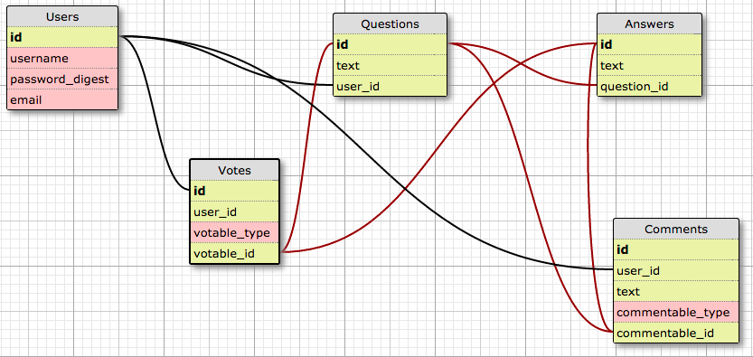

# Star-Overflow
Stack-Overflow Mock - Group: Sheldon, Ben, Lowell
####[Trello Board](https://trello.com/b/khjN1tud/stack-overflow-mock)
####[Slack Channel](https://copypastateam.slack.com)
## Database Schema:

##Tuesday:
Working agreements: 
  - All in on Friday (work late to front load work)
  - Saturday: Ben & Lowell (at least 8 hours)
  - Sunday: Sheldon (tie up loose ends)

##Wednesday:
Database and Models:

##Thursday:
User Stories / Wire-frames

**Talked about getting trello board / slack channel up on Wednesday and possibly making DB together that day
**Commited to polymorphic associations
**Talked about getting the DB finalized on Thursday and setting up routes

##Working List of Features
Features:
  - CRUD Users (include profile)
  - CRUD Questions
  - CRUD Comments
  - CRUD Sub-Comments
  - Votes
  - Auth
  - Styling
  - AJAX votes
